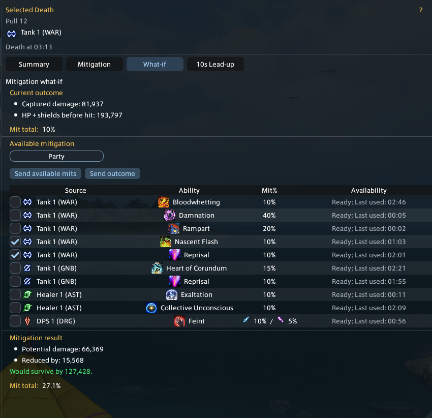
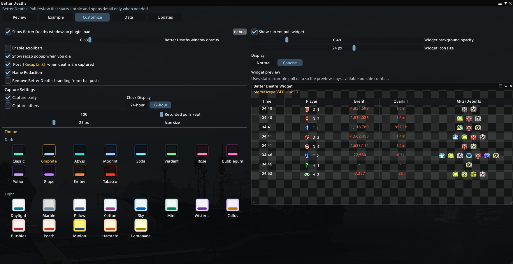

# Better Deaths

Better Deaths is a Dalamud plugin for reviewing FFXIV raid deaths with pull-level context.

Website: https://nainaiowo.github.io/better-deaths/

It helps you review:

- party-wide death order by pull
- fatal events, captured hit details, and overkill context
- HP plus shields before the fatal event
- active player mitigations, shields, debuffs, and target mitigation
- 10-second HP history with source, event, and status snapshots
- What-if mitigation checks using available party tools
- current pull review, widget display, themes, name redaction, and saved pull history

## What It Does

Better Deaths is built around fast raid review. It keeps deaths grouped by pull, shows the timeline in death order, and opens each player into the details that matter for figuring out what happened.

It also includes:

- fatal event summaries with source, action, amount, damage type, and enemy HP at death
- HP plus shields before the fatal event, including shield and HP movement in the lead-up
- mitigation review with active effects, expired context, and calculated mitigation total
- What-if mitigation review for checking how selected available mits would have changed the hit
- 10-second lead-up history with captured events, heals, hits, sources, and status timers
- current pull review and an optional widget with normal and concise display modes
- multiple themes, widget opacity controls, optional scrollbars, and name redaction
- locally saved pull history that remains available after wipes
- chat posts for a selected channel with optional recap links for participating Better Deaths users

## Privacy And Data

Better Deaths does not upload your data. It has no upload functions, telemetry, analytics, webhook, feedback endpoint, or hidden network reporting built into the plugin.

Recorded pulls are saved locally so you can review them after wipes, resets, reloads, or plugin updates. Saved pull files can include player names, jobs, duty names, death timing, HP, shields, damage events, actions, statuses, and mitigation context.

Name Redaction helps with screenshots and shared display, but local saved pull files may still contain the original captured names.

## Screenshots

### Death Timeline


### What-if Mitigation



### 10 Second Lead-Up


### Themes And Widget Preview



## Commands

```text
/betterdeaths
/bd
/betterdeathswidget
/bdwidget
```

## Dalamud Repository

Add this custom plugin repository URL in Dalamud:

```text
https://raw.githubusercontent.com/Nainaiowo/IMakeSillyThings/refs/heads/main/repo.json
```

Then install `Better Deaths` from Dalamud's plugin installer.

## Notes

Better Deaths only functions in duties, not overworld combat or PvP.

This is a work in progress raid review tool, so feedback and issue reports are welcome.
