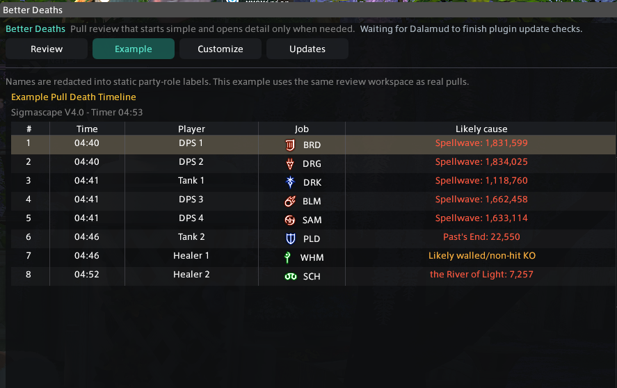
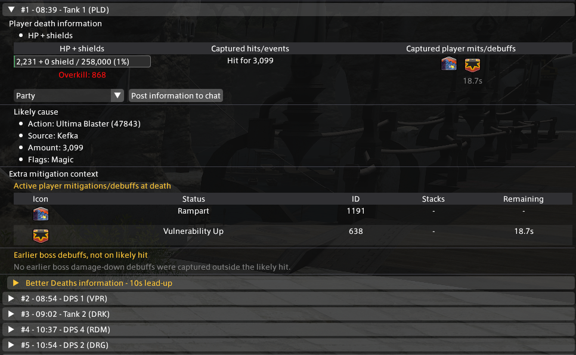
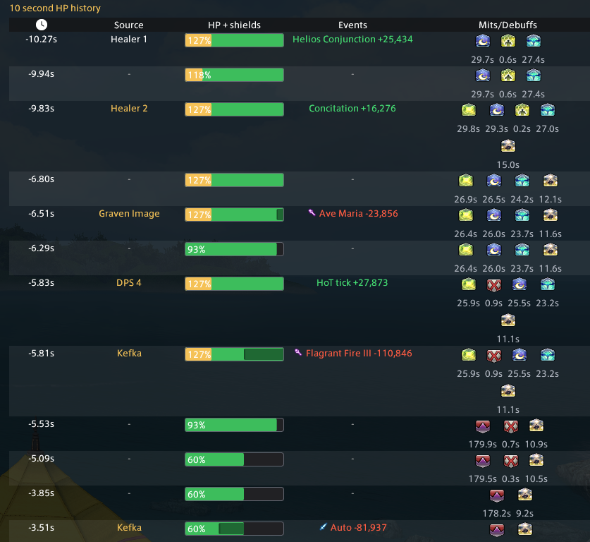

# Better Deaths

Better Deaths is a Dalamud plugin for reviewing party deaths with pull-level context.

It records and keeps:

- party-wide death order by pull
- likely death causes and captured hit details
- HP plus shields before the selected hit
- active player mitigations, shields, debuffs, and boss damage-downs
- recent HP and event history before each death
- recorded pull groups after wipes, recommences, and territory changes

## What It Does

Better Deaths is built around raid review after a pull ends. It keeps deaths grouped by pull, shows the timeline in death order, and expands each player into the details that matter for figuring out what happened.

It also includes:

- HP plus shields before the likely hit
- a compact HP bar with shields shown separately
- active mitigation, shields, protections, and boss damage-down debuffs
- 10 second lead-up history with captured hits and events
- current pull review and an optional widget
- locally saved pull history that remains available after wipes
- chat posts for a selected channel with recap links
- clickable recap links created from Better Deaths chat posts to share with participating party members with the plugin

## Screenshots

### Death Timeline



### Player Death Information



### 10 Second Lead-Up



## Commands

```text
/betterdeaths
/bd
/betterdeathswidget
/bdwidget
```

## Dalamud Repository

Add this custom plugin repository URL in Dalamud:

```text
https://raw.githubusercontent.com/Nainaiowo/IMakeSillyThings/refs/heads/main/repo.json
```

Then install `Better Deaths` from Dalamud's plugin installer.

## Notes

Better Deaths only functions in duties, not overworld combat or PvP.

This is a work in progress raid review tool, so feedback and issue reports are welcome.
